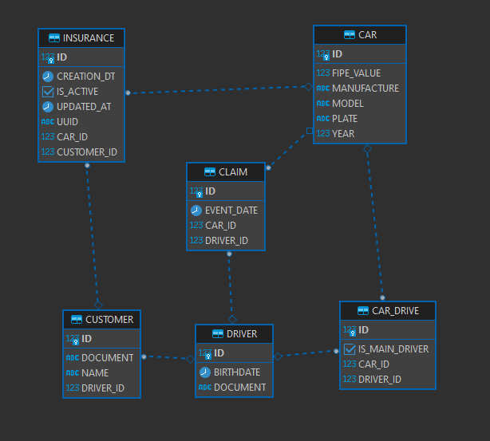

# Insurance

This project aims at services related to car insurance quotes

## Architecture

| Package     | Intent |
| --------|---------|
| core  | Should only need to look inside this package to know what the system does. Has no dependencies to any framework (e.g. Spring, hibernate, play, drop wizard…) |
| core > domain | Entities and value objects |
| core > usecase | The use cases (or application services) |
 |

| Module     | Intent |
| --------|---------|
| adapter  | Converts the domain objects returned by the uses cases into the appropriate format (e.g. DTO’s) for use in the periphery |
| periphery | Anything framework related (e.g. repositories, controllers) |
| configuration | How the application is glued together (e.g. spring @Configuration classes) |

## Database Model

This is the database diagram
